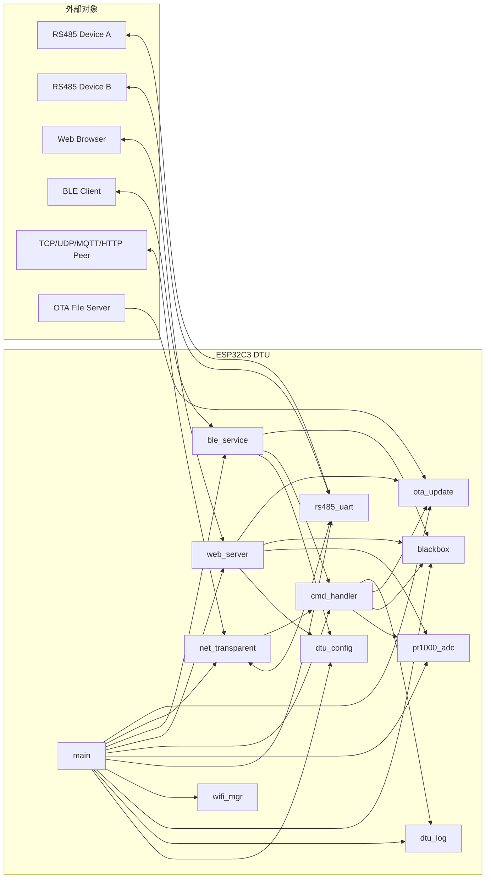
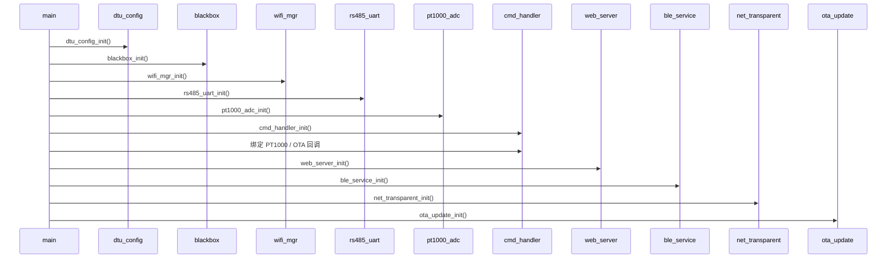
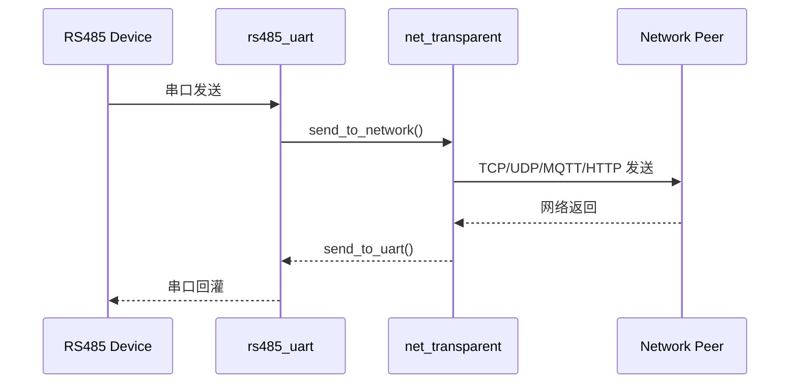
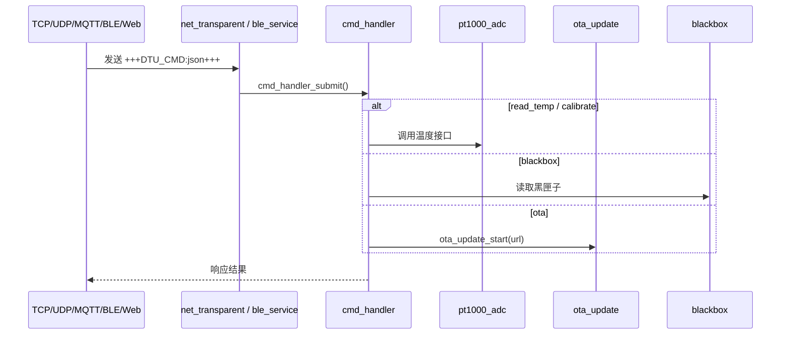

# ESP32C3 DTU 交付附录：系统图与接口表

## 文档信息

| 项目 | 内容 |
| --- | --- |
| 文档名称 | ESP32C3 DTU 交付附录：系统图与接口表 |
| 适用项目 | `ESP32C3_DTU` |
| 当前版本 | `V1.1` |
| 关联文档 | `软件设计方案.md`、`使用手册.md` |

## 1. 使用说明

本文档集中提供：

- 软件总体结构图
- 启动与数据流时序图
- 组件接口表
- Web REST API 表
- 特殊命令表
- 核心配置字段表

## 2. 系统总体图



## 3. 时序图

### 3.1 启动时序



### 3.2 普通透传数据流



### 3.3 命令流



## 4. 组件接口表

| 组件 | 关键接口 | 说明 |
| --- | --- | --- |
| `dtu_config` | `dtu_config_init()` | 初始化配置与默认值 |
| `dtu_config` | `dtu_config_get()` | 获取完整配置副本 |
| `dtu_config` | `dtu_config_set()` | 整体覆盖配置并持久化 |
| `dtu_config` | `dtu_config_set_str/u8/u16/u32()` | 按字段更新配置 |
| `dtu_log` | `dtu_log_init()` | 初始化日志开关状态 |
| `dtu_log` | `dtu_log_enable()` | 单模块开关日志 |
| `dtu_log` | `dtu_log_enable_all()` | 全局开关日志 |
| `blackbox` | `blackbox_init()` | 初始化黑匣子分区 |
| `blackbox` | `blackbox_record()` | 写入关键事件 |
| `blackbox` | `blackbox_read_recent()` | 读取最近若干条记录 |
| `blackbox` | `blackbox_clear()` | 清空黑匣子 |
| `wifi_mgr` | `wifi_mgr_init()` | 按配置启动 STA/AP/APSTA |
| `wifi_mgr` | `wifi_mgr_connect()` | 发起 STA 连接 |
| `wifi_mgr` | `wifi_mgr_start_ap()` | 启动 AP |
| `wifi_mgr` | `wifi_mgr_get_status()` | 获取 WiFi 状态 |
| `rs485_uart` | `rs485_uart_init()` | 初始化双路 RS485 |
| `rs485_uart` | `rs485_uart_send()` | 发送串口数据 |
| `rs485_uart` | `rs485_uart_get_rx_queue()` | 获取 RX 队列 |
| `rs485_uart` | `rs485_uart_set_baud()` | 动态改波特率 |
| `rs485_uart` | `rs485_uart_set_config()` | 完整重配串口 |
| `net_transparent` | `net_transparent_init()` | 初始化透传引擎 |
| `net_transparent` | `net_transparent_set_mode()` | 切换协议模式 |
| `net_transparent` | `net_transparent_reconnect()` | 重建网络通道 |
| `net_transparent` | `net_transparent_get_status()` | 获取网络就绪状态 |
| `net_transparent` | `net_transparent_send_to_network()` | 串口上行到网络 |
| `net_transparent` | `net_transparent_send_to_uart()` | 网络下行到串口 |
| `cmd_handler` | `cmd_handler_init()` | 初始化命令队列和任务 |
| `cmd_handler` | `cmd_handler_is_command()` | 判定是否命令帧 |
| `cmd_handler` | `cmd_handler_submit()` | 异步提交命令 |
| `cmd_handler` | `cmd_handler_set_response_cb()` | 绑定命令响应出口 |
| `cmd_handler` | `cmd_handler_set_pt1000_funcs()` | 绑定温度功能 |
| `cmd_handler` | `cmd_handler_set_ota_func()` | 绑定 OTA 功能 |
| `pt1000_adc` | `pt1000_adc_init()` | 初始化温度采集 |
| `pt1000_adc` | `pt1000_adc_read_temperature()` | 读取温度 |
| `pt1000_adc` | `pt1000_adc_calibrate()` | 执行校准 |
| `web_server` | `web_server_init()` | 启动 Web 服务 |
| `web_server` | `web_server_stop()` | 停止 Web 服务 |
| `web_server` | `web_server_set_pt1000_funcs()` | 注入温度功能 |
| `web_server` | `web_server_set_ota_func()` | 注入 OTA 功能 |
| `ble_service` | `ble_service_init()` | 启动 BLE 服务 |
| `ble_service` | `ble_service_notify_status()` | 预留状态推送接口 |
| `ota_update` | `ota_update_init()` | 启动时确认镜像状态 |
| `ota_update` | `ota_update_start()` | 启动 URL OTA |
| `ota_update` | `ota_update_get_progress()` | 查询 OTA 进度 |
| `ota_update` | `ota_update_is_in_progress()` | 查询 OTA 是否进行中 |

## 5. Web REST API 表

| 方法 | 路径 | 功能 | 说明 |
| --- | --- | --- | --- |
| `GET` | `/` | 返回配置页面 | 内嵌 HTML 页面 |
| `GET` | `/api/v1/config` | 读取当前配置 | 返回配置 JSON |
| `PUT` | `/api/v1/config` | 更新配置字段 | 支持局部更新 |
| `POST` | `/api/v1/config/apply` | 应用配置并重启 | 返回后设备重启 |
| `GET` | `/api/v1/status` | 获取状态 | 返回 `wifi_status/net_status/free_heap/uptime` |
| `GET` | `/api/v1/status/temperature` | 获取温度 | 返回 `temp_c` |
| `POST` | `/api/v1/calibrate` | PT1000 校准 | 请求体可带 `ref_ohm` |
| `GET` | `/api/v1/blackbox` | 读取黑匣子 | 支持 `count` 查询参数 |
| `DELETE` | `/api/v1/blackbox` | 清空黑匣子 | 返回 `status=ok` |
| `GET` | `/api/v1/log_config` | 读取日志开关 | 返回已启用模块数组 |
| `PUT` | `/api/v1/log_config` | 修改日志开关 | 支持 `enable_all` 和 `enabled` |
| `POST` | `/api/v1/ota` | 启动 OTA | 请求体传 `url` |

## 6. 特殊命令表

命令帧格式：

```text
+++DTU_CMD:{"cmd":"xxx"}+++
```

| 命令 | 参数 | 功能 | 典型返回 |
| --- | --- | --- | --- |
| `read_temp` | 无 | 读取温度 | `{"temp_c":xx.xx,"status":"ok"}` |
| `calibrate` | `ref_ohm` | 执行 PT1000 校准 | `{"status":"ok","msg":"calibration done"}` |
| `status` | 无 | 查询设备状态摘要 | JSON |
| `blackbox` | `count` | 读取最近黑匣子 | 记录数组 |
| `log_ctrl` | `module`,`enable` | 控制日志 | 当前实现按 `enable` 做全局开/关 |
| `ota` | `url` | 启动 OTA | `{"status":"started"}` |
| `restart` | 无 | 软件重启 | `{"status":"restarting"}` |

## 7. 核心配置字段表

| 字段 | 类型 | 含义 | 当前默认值 |
| --- | --- | --- | --- |
| `wifi_ssid` | string | WiFi SSID | `xiaowu` |
| `wifi_pass` | string | WiFi 密码 | `Wsy17820416856` |
| `wifi_mode` | u8 | WiFi 模式 | `1` |
| `srv1_ip` | string | 通道 1 服务器地址 | `192.168.1.100` |
| `srv1_port` | u16 | 通道 1 服务器端口 | `8080` |
| `srv2_ip` | string | 通道 2 服务器地址 | `192.168.1.100` |
| `srv2_port` | u16 | 通道 2 服务器端口 | `8080` |
| `uart1_mode` | u8 | 通道 1 透传模式 | `0` |
| `uart2_mode` | u8 | 通道 2 透传模式 | `0` |
| `uart1_baud` | u32 | UART1 波特率 | `9600` |
| `uart2_baud` | u32 | UART2 波特率 | `9600` |
| `mqtt_broker` | string | MQTT Broker URI | 空 |
| `mqtt_client_id` | string | MQTT Client ID | `esp32c3_dtu` |
| `mqtt_pub_topic1` | string | 通道 1 MQTT 上行 topic | `dtu/ch1/up` |
| `mqtt_sub_topic1` | string | 通道 1 MQTT 下行 topic | `dtu/ch1/down` |
| `mqtt_pub_topic2` | string | 通道 2 MQTT 上行 topic | `dtu/ch2/up` |
| `mqtt_sub_topic2` | string | 通道 2 MQTT 下行 topic | `dtu/ch2/down` |
| `http_url1` | string | 通道 1 HTTP URL | 空 |
| `http_url2` | string | 通道 2 HTTP URL | 空 |
| `ota_url` | string | OTA 固件 URL | 空 |
| `uart_bind` | u8 | 下行绑定方式 | `0` |
| `heartbeat_en` | u8 | 心跳开关 | `1` |
| `heartbeat_interval` | u32 | 心跳周期 | `30` |
| `reconnect_interval` | u32 | 重连周期 | `10` |
